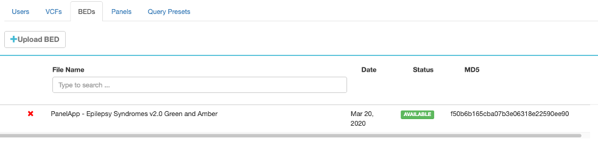

# Administration

## Users
The user management section allows the adding and removal of new users. Permissions can be granted depending on the needs.

## Sample files (VCF)
Available variant files are listed and can be removed from DART if obsolete. Results based on the VCF file continue to be availble in DART.

## Region of interest
Allows to upload regions of interest in BED ([link](https://en.wikipedia.org/wiki/BED_(file_format))) file format.

