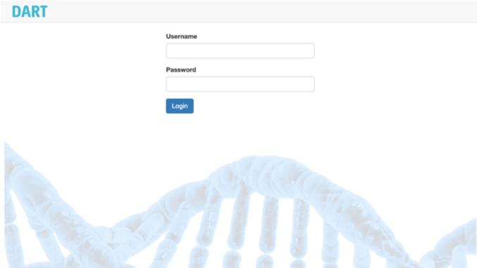
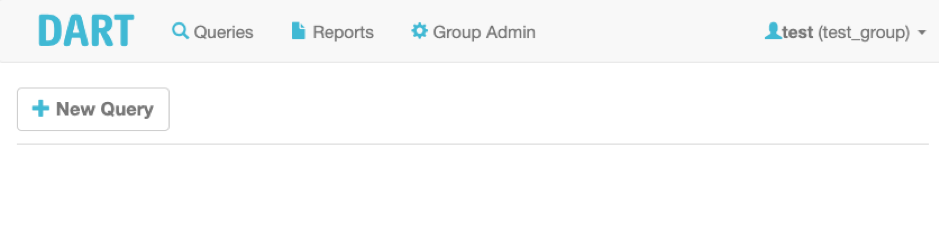

# Getting started
DART provides a secure environment, where only registered and authenticated users have access to.

## Overview
DART provides fast access to current analyses, reports and administration (if permitted)

## Queries

More details about standardised filtering of variants can be found [here](guide-queries.md)

## Reports

Creating, accessing and managing reports are describes [here](guide-report.md)

## Admin panel

Learn about user, sample and virtual pannel management [here](guide-admin.md)