# Query Samples

__Queries__ allow the selection of __sample or families__, __virtual gene__ panels (gene names or genomic relevant regions) and predefined __standardised filters__.

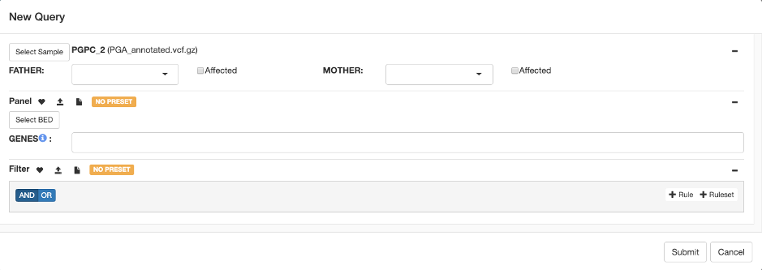

## Sample selection
An identifier is searched across all accessible variant files and can be further refined by the file name, date, sample type or reference genome.

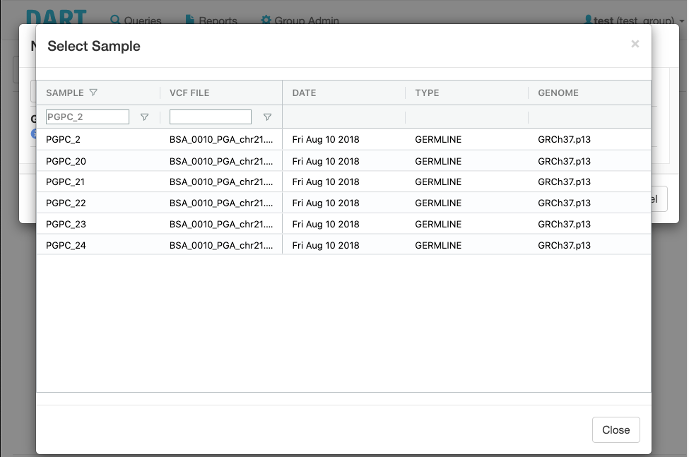

## Virtual Gene Panel
Disease specific panels can be pre-defined in DART to provide
patient relevant analyses. Panels can be defined as HGNC gene 
names or as genomic relevant regions. The use of panels can be 
enforced to prevent secondary findings.

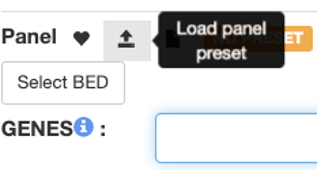

## Standardised filtering
Disease specific filtering strategies can be prepared to allow for 
different modes of inheritance (e.g. dominant, recessive) and 
expected frequency in the population.

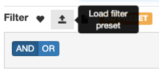

## Query status

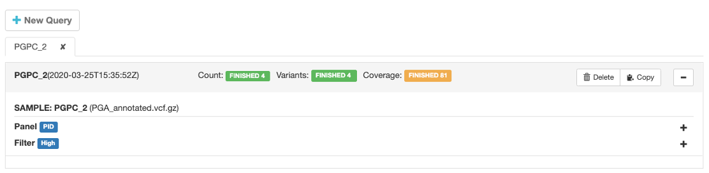
 
## Query result
Variants passing the filter criteria are displayed one per row and can be interactively explored (sorted, filtered, …).
 
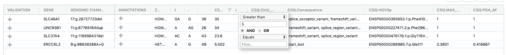

## Variant details
Compact visual variant representation allows an efficient analysis of clinical relevance.
 
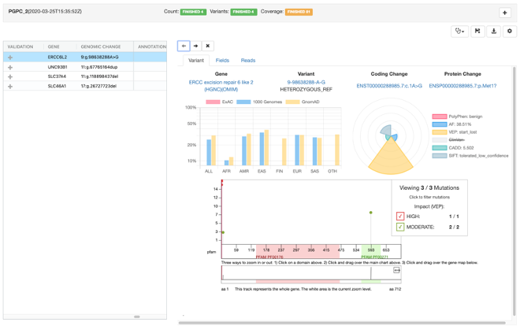

## Disease focus
Disease context specific analysis of a patient enables the clinical assessment of variants for the selected disease(s). Previous variant annotations are displayed and highlighted depending on the disease focus.
 
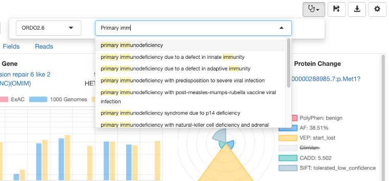

## Variant curation
DART supports the ACMG-AMP (link) annotation of variants in the disease context. Variant curations are stored at your institution in DART as a knowledge base and provided as guidance across samples and diseases.

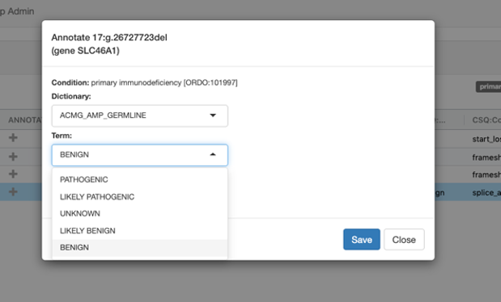
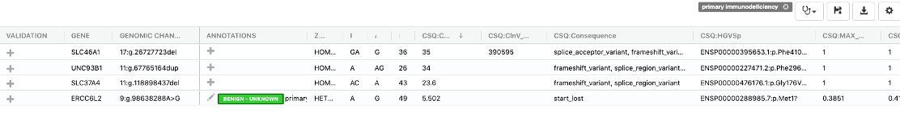

## Report generation
All query related information is included in the creation of a report. The query and returned variants are stored with the available annotations and curation information at the time.

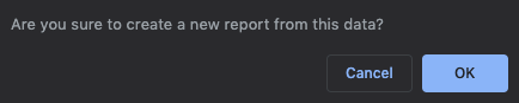

<!-- 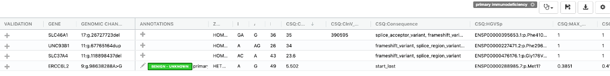{: style="height:100px;width:500px"} -->

